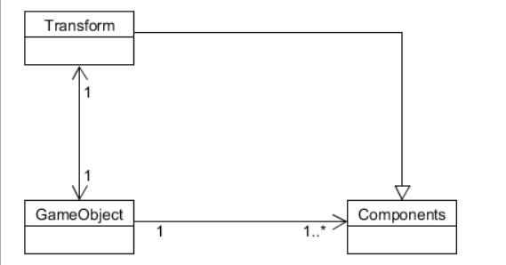

public# Homework_1
## 基础概念

1. 解释游戏对象（GameObjects）和资源（Assets）的区别与联系。
+ 区别
     + 游戏对象
     
     > 游戏中的每一个对象都是一个游戏对象，在我们赋予属性和加入组件后，就成为了游戏的角色环境等等。
       
     + 资源
     
     > 资源包括对象、材质、声音、场景、脚本、动作资源等等。可以被导入游戏项目中成为游戏对象或被游戏对象使用。
       
+ 联系
> 资源能被导入游戏中，与游戏对象相互配合完成相应的游戏功能。

2. 下载几个游戏案例，分别总结资源、对象组织的结构
> 资源文件夹中通常包含对象、材质、场景、声音、预设、贴图、脚本、动作等，在子文件夹中可以继续划分。
>
> 对象一般有玩家、敌人、环境、摄像机、音乐等虚拟父类，这些父类没有实体，但由它们继承出的子类包含了游戏中的对象。
变化组件决定了场景中游戏对象的位置，大小和旋转关系。
组件是游戏对象和其对应行为之间的枢纽。3.编写一个代码，使用 debug 语句来验证 MonoBehaviour 基本行为或事件触发的条件 

> 基本行为包括 Awake() Start() Update() FixedUpdate() LateUpdate()
>
> 常用事件包括 OnGUI() OnDisable() OnEnable()
```C#
public class test:MonoBehaviour
{
  void Awake()
  {
    Debug.Log("onAwake");
  }
  void Start()
  {
    Debug.Log("onStart");
  }
  void Update()
  {
    Debug.Log("onUpdate");
  }
  void FixedUpdate() 
  {
    Debug.Log ("onFixedUpdate");
  }
  void LateUpdate() 
  {
    Debug.Log ("onLateUpdate");
  }
  void OnGUI() 
  {
    Debug.Log ("onGUI");
  }
  void Reset() 
  {
    Debug.Log ("onReset");
  }
  void OnDisable() 
  {
    Debug.Log ("onDisable");
  }
  void OnDestroy() 
  {
    Debug.Log ("onDestroy");
  }
}
```

4.查找脚本手册，了解GameObject，Transform，Component对象
> 分别翻译官方对三个对象的描述（Description）
+ 游戏对象是在 Unity 中代表任务，道具和场景的基础对象
+ 变化组件决定了场景中游戏对象的位置，大小和旋转关系。
+ 组件是游戏对象和其对应行为之间的枢纽。
> 描述下图中table对象（实体）的属性、table 的Transform的属性、 table的部件
+ table对象（实体）的属性
  + layer : Default
  + tag : Untagged
+ table的Transform属性
  + Position（0,0,0）
  + Rotation（0,0,0）
  + Scale（1,1,1）
+ 用 UML 图描述 三者的关系(请使用 UMLet 14.1.1 stand-alone版本出图)
     >
     >
5.整理相关学习资料，编写简单代码验证以下技术的实现： 
> 查找对象
> 添加子对象
> 遍历对象树
> 清除所有子对象
```c#
//查找对象
public static GameObject Find(string name)//通过名字查找
public static GameObject FindWithTag(string tag)//通过标签查找单个对象
public static GameObject[] FindGameObjectsWithTag(string tag)//通过标签查找多个对象
//添加子对象
public static GameObect CreatePrimitive(PrimitiveTypetype)
//遍历对象树
foreach(Transform child in transform)
{
     Debug.Log(child.gameObject.name);
}
//清除所有子对象
foreach(Transform child in transform)
{
     Destory(child.gameObject);
}
```
6.资源预设（Prefabs）与对象克隆 (clone) 
> 预设(Prefabs)有什么好处？与对象克隆 (clone or copy or Instantiate of Unity Object) 关系？
+ 预设是一种资源，向场景添加一个预设时，会创建它的一个实例。所以预设可以看作游戏对象的一种模板。当更改预设时，会同时应用于所有与之相连的实例。
+ 对象克隆，就是copy一个原本对象的实例，两者之间没有影响
> 制作 table 预制，写一段代码将 table 预制资源实例化成游戏对象
```c#
public class NewBehaviourScript : MonoBehaviour
{
     private string prePath = "prefabs/table";
     void Start () 
     {
          GameObject Table = Instantiate(Resource.Load(prePath), new Vector(4, 0, 0), Quaternion.identity) as GameObject;
     }
}
```
7.尝试解释组合模式（Composite Pattern / 一种设计模式）。使用 BroadcastMessage()方法向子对象发送消息
> 组合模式是将对象组合成树形结构来表现“部分-整体”的层次结构，使用户对单个对象和组合对象的使用具有一致性。
>
> 父类对象：
```c#
public class ParentBehaviourScript : MonoBehaviour 
{
       void Start () 
       {
           this.BroadcastMessage("Test");
       }
}
```
> 子类对象：
```c#
public class ChildBehaviourScript : MonoBehaviour 
{
        void Test() 
        {
            Debug.Log("Child Received");
        }
}
```
