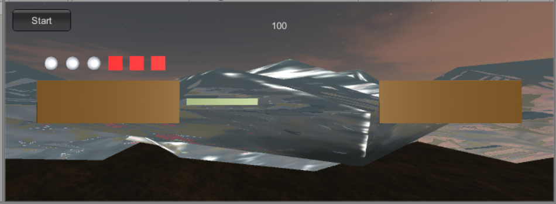

# Homework3
Priests and DevilsV2.0(动作分离版本)
## 参考 Fantasy Skybox FREE 构建自己的游戏场景

使用了一个Skybox和water
## 写一个简单的总结，总结游戏对象的使用
>游戏对象可以通过实例化直接使用，这样适用于只使用一次，无多共性的游戏对象;也可以通过预制来实例化，这种方式可以满足有着多数共性的游戏对象的实例化，不必每次重复创建对象和赋值。
>
>游戏对象的活动主要通过调节位置来实现。
>
>游戏对象可以使用material渲染，一个游戏对象可以用不同material渲染出多个副本，而不改变基础属性。

## Priests and DevilsV2.0
动作分离，即将GameObject 可执行的动作，划分为许多相同的基础动作的，如直线运动，对话等，然后使用一个动作类和一个执行类去完成 GameObject 的动作，同时，配备一个动作管理者，让其去调度，这样代码就不会显得冗余。

### 建立动作管理器的意义
在上一个版本中，在GenGameObject中写了大量物体运动的函数，导致的结果是当需要修改move时，每一个类都可能需要修改，新建动作也十分麻烦，代码冗余严重。动作管理器的意义就在于建立抽象的基础动作类SSAction，在移动时只需要新建一个它的子类，在子类中实现具体的移动，这样减少了代码量也利于修改维护。
### 代码实现
1.动作基类
动作的基类，定于GameObject的动作内容。
在魔鬼与牧师中，我们只需用到Transform属性对物体实现直线运动
其中 Start 和 Update 方法，是实现动作的基础函数，throw 语句是为了提醒用户实现这个接口。
```c#
public class SSAction : ScriptableObject
{

    public bool enable = true;
    public bool destroy = false;

    public GameObject gameObject { get; set; }
    public Transform transform { get; set; }
    public ISSActionCallback callback { get; set; }

    public virtual void Start()
    {
        throw new System.NotImplementedException();
    }

    public virtual void Update()
    {
        throw new System.NotImplementedException();
    }
}
```
2.基础动作
创建动作基类的子类基础动作，用Transform属性构造直线运动
```c#
public class MoveToAction : SSAction
{
    public Vector3 target;
    public float speed;
    public static MoveToAction getAction(Vector3 target, float speed)
    {
        MoveToAction action = ScriptableObject.CreateInstance<MoveToAction>();
        action.target = target;
        action.speed = speed;
        return action;
    }
    public override void Update()
    {
        this.transform.position = Vector3.MoveTowards(this.transform.position, target, speed * Time.deltaTime);
        if (this.transform.position == target)
        {
            this.destroy = true;
            this.callback.actionDone(this);
        }
    }
    public override void Start() { }
}
```
3.组合动作
用直角折线运动实现人物上下船/岸，需要组合两步基础动作
```c#
public class SequenceAction : SSAction, ISSActionCallback
{
    public List<SSAction> sequence;
    public int repeat = -1; //-1表示无限循环，0表示只执行一遍，repeat> 0 表示重复repeat遍
    public int currentAction = 0;//当前动作列表里，执行到的动作序号

    public static SequenceAction getAction(int repeat, int currentActionIndex, List<SSAction> sequence)
    {
        SequenceAction action = ScriptableObject.CreateInstance<SequenceAction>();
        action.sequence = sequence;
        action.repeat = repeat;
        action.currentAction = currentActionIndex;
        return action;
    }

    public override void Update()
    {
        if (sequence.Count == 0) return;
        if (currentAction < sequence.Count)
        {
            sequence[currentAction].Update();
        }
    }

    public void actionDone(SSAction source)
    {
        source.destroy = false;
        this.currentAction++;
        if (this.currentAction >= sequence.Count)
        {
            this.currentAction = 0;
            if (repeat > 0) repeat--;
            if (repeat == 0)
            {
                this.destroy = true;
                this.callback.actionDone(this);
            }
        }
    }
    public override void Start()
    {
        foreach (SSAction action in sequence)
        {
            action.gameObject = this.gameObject;
            action.transform = this.transform;
            action.callback = this;
            action.Start();
        }
    }
    void OnDestroy()
    {
        foreach (SSAction action in sequence)
        {
            DestroyObject(action);
        }
    }
}
```
4.动作管理
管理调度动作执行
```c#
public class SSActionManager : MonoBehaviour
{
    private Dictionary<int, SSAction> actions = new Dictionary<int, SSAction>();
    private List<SSAction> waitingToAdd = new List<SSAction>();
    private List<int> watingToDelete = new List<int>();

    protected void Update()
    {
        foreach (SSAction ac in waitingToAdd)
        {
            actions[ac.GetInstanceID()] = ac;
        }
        waitingToAdd.Clear();

        foreach (KeyValuePair<int, SSAction> kv in actions)
        {
            SSAction ac = kv.Value;
            if (ac.destroy)
            {
                watingToDelete.Add(ac.GetInstanceID());
            }
            else if (ac.enable)
            {
                ac.Update();
            }
        }

        foreach (int key in watingToDelete)
        {
            SSAction ac = actions[key];
            actions.Remove(key);
            DestroyObject(ac);
        }
        watingToDelete.Clear();
    }

    public void RunAction(GameObject gameObject, SSAction action, ISSActionCallback whoToNotify)
    {
        action.gameObject = gameObject;
        action.transform = gameObject.transform;
        action.callback = whoToNotify;
        waitingToAdd.Add(action);
        action.Start();
    }
}
```
5.场景与场景动作管理
动作分离后，我们需要去掉场景中的动作执行代码，用场景动作管理器调用动作
```c#
public class FirstSSActionManager : SSActionManager, ISSActionCallback
{
    public FirstSceneController scene;
    public MoveToAction action1, action2;
    public SequenceAction saction;
    float speed = 30f;

    /**
     * 为小船设置水平移动动作
     */
    public void moveBoat(GameObject boat)
    {
        action1 = MoveToAction.getAction((boat.transform.position == new Vector3(4, 0, 0) ? new Vector3(-4, 0, 0) : new Vector3(4, 0, 0)), speed);
        this.RunAction(boat, action1, this);
    }

    /**
     * 人的上船动作
     * 为人设置水平和垂直两个分解动作，然后组合起来执行
     */
    public void getOnBoat(GameObject people, int shore, int seat)
    {
        ```
    }

    /**
     * 人的下船动作
     */
    public void getOffBoat(GameObject people, int shoreNum)
    {
        ```
    }

    protected void Start()
    {
        scene = (FirstSceneController)SSDirector.getInstance().currentScenceController;
        scene.actionManager = this;
    }

    protected new void Update()
    {
        base.Update();
    }

    public void actionDone(SSAction source)
    {
        Debug.Log("Done");
    }
}
```
6.更改后的FirstController，只执行load场景和调用动作管理员的任务
```c#
public class FirstSceneController : MonoBehaviour, IUserAction, ISceneController
{

    //```
    void Update()
    {
        Judge();
    }

    public void LoadResources()
    {
        ```
    }
    public void clickOne()
    {
        ```
    }
    void MovePeople(GameObject people)
    {
        ```
    }
    void MoveBoat()
    {
        ```
    }
    public void Judge()
    {
        ```
    }
    //```
}
```
