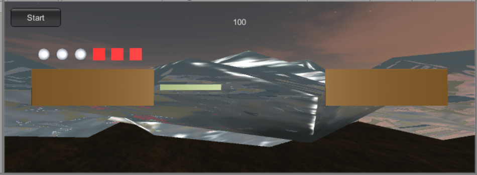

# Homework3
Priests and DevilsV2.0(动作分离版本)
## 参考 Fantasy Skybox FREE 构建自己的游戏场景

使用了一个Skybox和water
## 写一个简单的总结，总结游戏对象的使用
>游戏对象可以通过实例化直接使用，这样适用于只使用一次，无多共性的游戏对象;也可以通过预制来实例化，这种方式可以满足有着多数共性的游戏对象的实例化，不必每次重复创建对象和赋值。
>
>游戏对象的活动主要通过调节位置来实现。
>
>游戏对象可以使用material渲染，一个游戏对象可以用不同material渲染出多个副本，而不改变基础属性。

## Priests and DevilsV2.0
动作分离，即将GameObject 可执行的动作，划分为许多相同的基础动作的，如直线运动，对话等，然后使用一个动作类和一个执行类去完成 GameObject 的动作，同时，配备一个动作管理者，让其去调度，这样代码就不会显得冗余。
